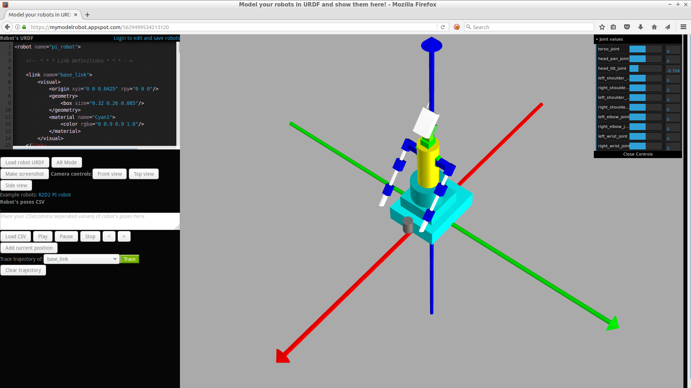

MyModelRobot
==========

MyModelRobot is a web-based application for designing and viewing robots described in URDF (Unified Robot Description Format) used in ROS. 

The tool focuses on simplicity of use, especially for teaching and rapid prototyping. The tool is used in Lodz University of Technology robotics curriculum (basics of robotics, mobile robotics and project work).

At the current state, the tool is capable of presenting URDFs with geometrical shapes, but not with meshes. You can move robot's joints using sliders and animate robots via CSV files. You can also view robots using Augmented Reality (AR).

## Quick Start

### Standalone Version (Recommended)

The easiest way to use MyModelRobot is the standalone version that requires no server setup:

1. Clone or download this repository
2. Open `standalone.html` in your web browser
3. Start designing and viewing robots!

For detailed instructions, see [INSTALL.md](INSTALL.md)

### Online Demo

You can also try the online demo at [http://mymodelrobot.appspot.com/](http://mymodelrobot.appspot.com/)

## Features

- **URDF Visualization**: Load and display robot models in 3D
- **Joint Controls**: Interactive sliders for moving robot joints
- **CSV Animation**: Animate robots with predefined joint trajectories
- **Multiple Views**: Front, top, and side camera presets
- **Augmented Reality**: View robots in AR mode
- **Screenshots**: Capture images of your robot models
- **Trajectory Tracing**: Visualize link paths during animation

## Documentation

- [INSTALL.md](INSTALL.md) - Detailed installation and usage instructions
- Example URDF files in the `testowe/` directory

## License

See repository for license information.
